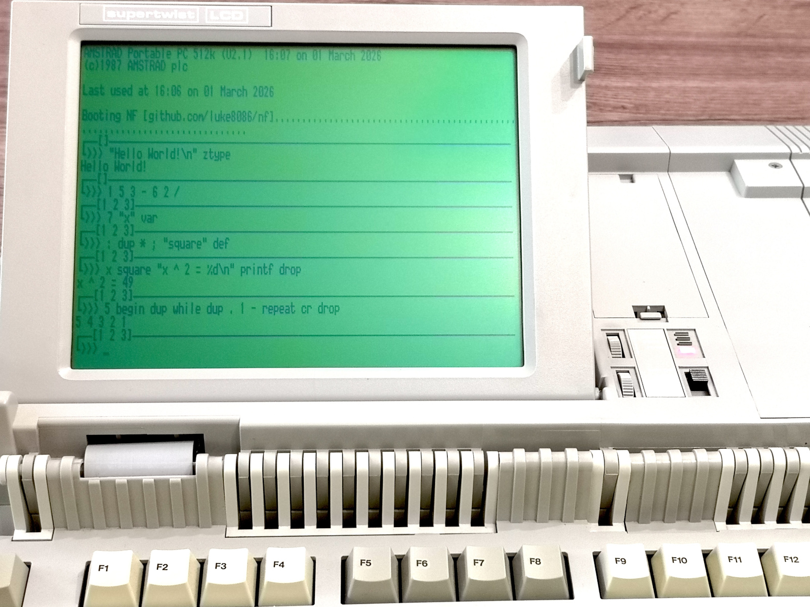

# NF

Forth-like interactive programming environment for 8086+ PCs.

Originally written as a shell for my
[hobby OS](https://github.com/luke8086/gentleos),
later repurposed as a standalone bootable app.



## Prerequisites

- Working DOS environment (typically through DOSBox)
- [Turbo C 2.01](https://edn.embarcadero.com/article/20841)
- [NASM](https://www.nasm.us/pub/nasm/releasebuilds/3.01/dos/)

## Building

Within DOS, just run `MAKE`

## Running in DOS

Run `BUILD\NF.COM`

## Running in QEMU

```
mkdir -p tmp
dd if=/dev/zero of=tmp/floppy.img bs=720k count=1
dd if=build/NF_DISK.img of=tmp/floppy.img conv=notrunc
qemu-system-i386 -drive format=raw,file=tmp/floppy.img
```

## Running on real hardware (on your own risk)

If you have a PC with support for booting from USB in BIOS mode, and an unused USB stick:

```
dd if=build/NF_DISK.IMG of=<your USB stick>
```

## Usage

See [USAGE.md](USAGE.md)
